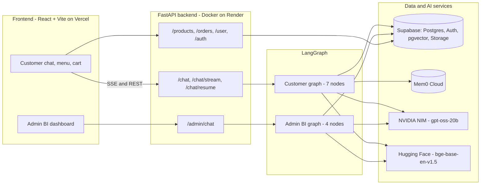
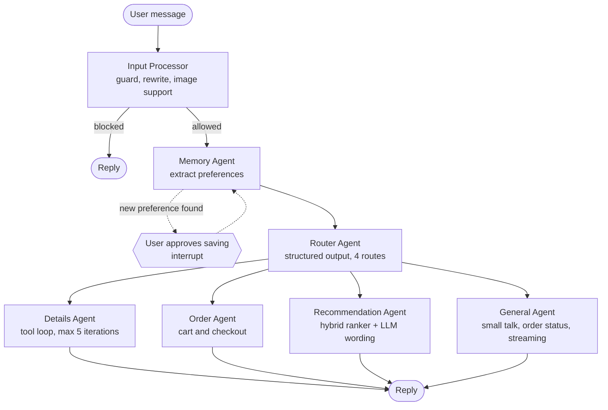
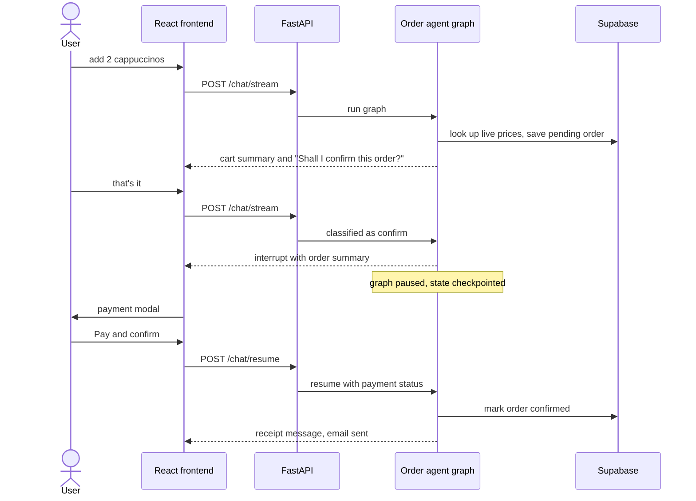
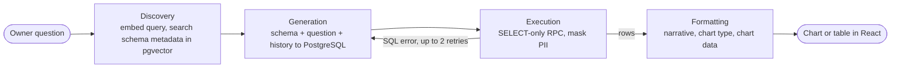
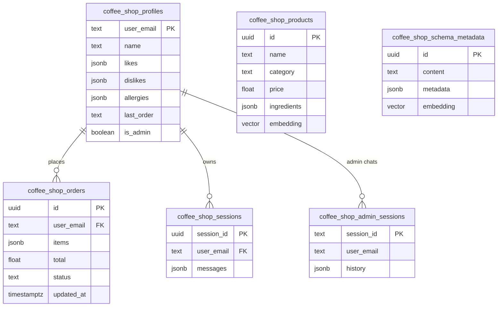

<div align="center">


<p>
  
  
  
  
  
  
  
</p>

<p>
  <a href="https://coffee-shop-chat-bot.vercel.app"><strong>🌐 Live Demo</strong></a> &nbsp;·&nbsp;
  <a href="https://coffee-shop-chatbot.onrender.com/docs"><strong>📡 API Docs</strong></a> &nbsp;·&nbsp;
  <a href="https://www.youtube.com/watch?v=APp6CWFgrXw"><strong>🎥 Video Walkthrough</strong></a> &nbsp;·&nbsp;
  <a href="./backend/README.md"><strong>⚙️ Backend Docs</strong></a> &nbsp;·&nbsp;
  <a href="./frontend/README.md"><strong>🎨 Frontend Docs</strong></a>
</p>

</div>

---

## Table of Contents

- [Overview](#overview)
- [Features](#features)
- [System Architecture](#system-architecture)
  - [Customer Agent Pipeline](#customer-agent-pipeline)
  - [Checkout with Human-in-the-Loop](#checkout-with-human-in-the-loop)
  - [Admin BI Pipeline](#admin-bi-pipeline)
  - [Memory Architecture](#memory-architecture)
  - [Data Model](#data-model)
- [Key Design Decisions](#key-design-decisions)
- [Tech Stack](#tech-stack)
- [API Overview](#api-overview)
- [Getting Started](#getting-started)
- [Configuration](#configuration)
- [Deployment](#deployment)
- [Repository Structure](#repository-structure)
- [Known Limitations and Roadmap](#known-limitations-and-roadmap)
- [License](#license)

---

## Overview

**Merry's Way** is a two-sided AI platform for a coffee shop, built on two independent LangGraph agent pipelines that share one FastAPI backend.

| Interface | Users | What it does |
|-----------|-------|--------------|
| **💬 Customer assistant** | Shop customers | Natural-language ordering, personalised recommendations, product Q&A, persistent memory of preferences and allergies, live token streaming, and a human-in-the-loop checkout |
| **📊 Admin BI dashboard** | Shop owner | Ask business questions in plain English and get a narrative plus an auto-selected chart or table, generated from live SQL |

**Guiding principle: the LLM decides and talks, code computes and enforces.** Prices always come from the database, cart totals are calculated in code, cart summaries are deterministic text, and recommendation candidates are filtered in Python before the model sees them.

---

## Features

### Customer assistant

- **Guarded, context-aware input**: an input processor resolves references ("two of those" → "two Cappuccinos"), blocks off-topic or unsafe requests, and accepts an uploaded image.
- **Persistent memory**: likes, dislikes and allergies are extracted from conversation, **confirmed by the user before saving**, and remembered across sessions.
- **Intent routing**: a structured-output router sends each message to one of four specialists.
- **Grounded product answers**: a tool-calling RAG agent searches the menu (pgvector), looks products up by name, and answers shop-info questions.
- **Cart and checkout**: add, update, remove and confirm items through chat. Checkout pauses the graph for explicit payment approval, then confirms the order and emails an HTML receipt.
- **Hybrid recommendations**: popularity, Apriori market-basket rules and content similarity, with allergen, dislike and in-cart filtering applied in code.
- **Real-time UX**: Server-Sent Events stream progress and tokens; chat history survives page refreshes.

### Admin BI

- **Text-to-SQL** over live order, product and profile data with schema discovery through pgvector.
- **Self-healing queries**: SQL errors are fed back to the model for up to two retries.
- **Time-aware analytics**: dates are interpreted in IST, and time-series reports include empty periods.
- **Privacy**: PII is masked in query results before the model sees them.
- **Chart inference**: the agent returns `bar`, `pie`, `line`, `table` or `none`, and the React dashboard renders it directly.

---

## System Architecture



### Customer Agent Pipeline

Every customer message runs through one directed LangGraph `StateGraph` that shares a single `CoffeeAgentState` (messages, user memory, semantic memories, active order, total, response).



| Node | Responsibility |
|------|----------------|
| **Input Processor** | Guard and intent refiner. Rewrites the message using the last 6 messages, blocks invalid requests, handles an attached image. |
| **Memory Agent** | Extracts likes, dislikes, allergies and other preferences, asks the user to approve, then writes to Supabase profiles and Mem0. |
| **Router** | `small_llm.with_structured_output(AgentDecision)` returns a typed target: `details`, `order`, `recommendation` or `general`. |
| **Details Agent** | Agentic loop (max 5 iterations) over `rag_tool` (pgvector semantic search), `product_info_tool` (exact name lookup with semantic fallback) and `about_us_tool`. |
| **Order Agent** | Classifies the action (create, update, remove, confirm, cancel), validates items and prices against Supabase, persists a pending order, and returns a deterministic cart summary. |
| **Recommendation Agent** | Calls the hybrid recommender for candidates, then lets the LLM phrase them. |
| **General Agent** | Greetings, order status, memory acknowledgements. The only agent whose tokens are streamed live. |

### Checkout with Human-in-the-Loop

Checkout uses LangGraph `interrupt()`: the graph pauses at a node boundary, its state is checkpointed, and it resumes only when the user approves payment.



The checkpointer is chosen at startup: `AsyncPostgresSaver` (psycopg pool on Supabase) when `SUPABASE_DB_URL` is set on Linux, otherwise an in-memory saver for local development.

### Admin BI Pipeline

A separate four-node graph in `src/agents/admin/admin_agent/`.



The final state returned to the dashboard is:

```json
{
  "narrative": "...",
  "chart_type": "bar | pie | line | table | none",
  "chart_data": [{ "name": "Cappuccino", "value": 760 }],
  "sql": "SELECT ..."
}
```

### Memory Architecture

| Layer | Store | Purpose | Lifetime |
|-------|-------|---------|----------|
| **Short-term** | Sliding window of recent messages in graph state | Conversational coherence and reference resolution | Per request |
| **Session history** | `coffee_shop_sessions` (JSONB, atomic RPC append) | Restore chat after refresh | Per session |
| **Structured profile** | `coffee_shop_profiles` | Likes, dislikes, allergies, last order, location | Permanent |
| **Semantic memory** | Mem0 Cloud | Free-form facts and context retrieved by similarity | Permanent |
| **Graph checkpoints** | Postgres checkpointer | Resume paused graphs (checkout, memory approval) | Per thread |

### Data Model



Order `status` is `pending` (the live cart) or `confirmed`. Cancelled orders are deleted. Order `items` are stored as `[{name, quantity, per_unit_price, total_price, image_url}]` and reference products by name.

---

## Key Design Decisions

| Decision | Why |
|----------|-----|
| **LangGraph instead of a plain chain** | Explicit nodes, shared typed state, routing via `Command(goto=...)`, and `interrupt()` with checkpointing for human approval. None of this is practical with a linear chain. |
| **Code computes, the LLM talks** | Prices come from Supabase, totals are summed in code, and cart summaries are deterministic text. The model never invents a number or claims an order is confirmed. |
| **Candidate filtering before generation** | The recommender removes allergen, disliked and in-cart items in Python before the LLM sees candidates, so a model slip cannot reintroduce them. |
| **Human approval for consequential actions** | Both saving a new preference and confirming a payment pause the graph and wait for the user. |
| **Structured outputs for control flow** | Router, input guard and the BI formatter use typed Pydantic schemas rather than free-text parsing. |
| **Separate customer and admin graphs** | Different users, risk profiles and state shapes, with admin access gated by `is_admin` in the profile table. |
| **Self-healing Text-to-SQL** | The execution error is injected into the next generation prompt, up to two retries. |
| **Parallel pre-load** | On `/chat`, session, profile, order, history and semantic-memory lookups run concurrently with `asyncio.gather` before the graph starts. |
| **Atomic persistence** | Chat messages are appended with a database-side RPC, avoiding read-modify-write races. |
| **Resilient menu endpoint** | `/products` is cached for 10 minutes and falls back to the bundled catalog if Supabase is unreachable. |

---

## Tech Stack

| Layer | Technology |
|-------|-----------|
| **LLM** | NVIDIA NIM (OpenAI-compatible API) via `langchain-openai`, default model `openai/gpt-oss-20b`, configurable by environment variable |
| **Agent framework** | LangGraph (`StateGraph`, `Command`, `interrupt`, Postgres checkpointing), LangChain |
| **Embeddings** | `BAAI/bge-base-en-v1.5` (768 dimensions) via Hugging Face |
| **Vector search** | Supabase pgvector (menu items and BI schema metadata) |
| **Semantic memory** | Mem0 Cloud |
| **Recommender** | scikit-learn, pandas: popularity + Apriori rules + content similarity |
| **Database and auth** | Supabase (PostgreSQL, Auth, Storage, RLS) |
| **Backend** | FastAPI, Uvicorn/Gunicorn, Python 3.11+, `uv` |
| **Email** | SMTP HTML receipts |
| **Frontend** | React 18, Vite 6, Tailwind CSS 3, React Router 7, Recharts 3, Framer Motion, React Markdown |
| **Streaming** | Server-Sent Events |
| **DevOps** | Docker, GitHub Actions (build checks + deploy hook), Render (backend), Vercel (frontend) |

---

## API Overview

Interactive docs are available at `/docs` (Swagger UI). Full request and response details are in the [backend README](./backend/README.md).

| Group | Endpoints |
|-------|-----------|
| **Auth** | `POST /auth/register`, `POST /auth/login` |
| **Chat** (JWT) | `POST /chat`, `POST /chat/stream` (SSE), `POST /chat/resume`, `GET /chat/history`, `POST /chat/upload` |
| **Admin** (JWT + admin) | `POST /admin/chat`, `GET /admin/history` |
| **User** (JWT) | `GET /user/me`, `GET` and `PUT /user/preferences` |
| **Menu** (JWT) | `GET /products?category=&search=` |
| **Orders** (JWT) | `GET`, `PUT`, `DELETE /orders/active`; `GET /orders/history` |

The SSE stream emits `status` (current agent node), `token`, `interrupt` (approval needed) and `error` events.

---

## Getting Started

### Prerequisites

Python 3.11+, [`uv`](https://docs.astral.sh/uv/), Node.js 22+, and accounts or keys for Supabase, NVIDIA NIM, Hugging Face and Mem0.

### 1. Clone

```bash
git clone https://github.com/Pandharimaske/Multi-Agent-Commerce-Platform-for-Coffee-Shop.git
cd Multi-Agent-Commerce-Platform-for-Coffee-Shop
```

### 2. Backend

```bash
cd backend
uv sync
# create backend/.env from the table in "Configuration" below
uv run uvicorn api.main:app --reload --reload-dir api --reload-dir src
```

API: `http://localhost:8000` · Docs: `http://localhost:8000/docs`

Or run it with Docker (uses Gunicorn with a Uvicorn worker):

```bash
cd backend
docker compose up --build
```

### 3. Frontend

```bash
cd frontend
npm install
echo "VITE_API_URL=http://localhost:8000" > .env
npm run dev
```

App: `http://localhost:5173`. Add this origin to `ALLOWED_ORIGINS` in the backend `.env`.

### 4. One-time database setup

1. Create a Supabase project and enable the `vector` extension.
2. Run [`backend/supabase_db/schema.sql`](./backend/supabase_db/schema.sql) in the SQL editor.
3. Seed the data:

```bash
cd backend
uv run python scripts/seed_products.py          # catalog (58 items) + embeddings
uv run python scripts/initialize_bi_agent.py    # BI schema tables and RPC functions
uv run python scripts/index_metadata.py         # schema metadata embeddings for the BI agent
uv run python scripts/migrate_images.py         # optional: product images to Supabase Storage
```

4. To use the admin dashboard, set `is_admin = true` for your user in `coffee_shop_profiles`.

> **Note:** a few database objects (the `embedding` column on products, the `match_coffee_products` search function and the `append_chat_messages` function) are not yet captured in `schema.sql`. See the [roadmap](#known-limitations-and-roadmap).

---

## Configuration

Set these in `backend/.env` (never commit it).

| Variable | Purpose |
|----------|---------|
| `NIM_API_KEY` | NVIDIA NIM API key (required) |
| `NIM_BASE_URL` | Defaults to `https://integrate.api.nvidia.com/v1` |
| `LLM_MODEL`, `SMALL_LLM_MODEL` | Model IDs, for example `openai/gpt-oss-20b` (NIM IDs include the organisation prefix) |
| `LLM_TIMEOUT_SECONDS` | Request timeout, default 60 |
| `HF_API_KEY`, `EMBEDDING_MODEL` | Embeddings (`BAAI/bge-base-en-v1.5`) |
| `MEM0_API_KEY` | Semantic memory |
| `SUPABASE_URL` | Supabase project URL |
| `SUPABASE_KEY` | Anon key (auth) |
| `SUPABASE_SERVICE_KEY` | Service-role key (server-side DB access) |
| `SUPABASE_DB_URL` | Postgres connection string for the graph checkpointer |
| `SMTP_HOST`, `SMTP_PORT`, `SMTP_USER`, `SMTP_PASSWORD`, `SMTP_FROM_EMAIL` | Receipt emails (optional; skipped if unset) |
| `APP_URL` | Public frontend URL, used for email image links |
| `ALLOWED_ORIGINS` | Comma-separated CORS origins |
| `LANGCHAIN_API_KEY` | Optional LangSmith tracing |

Frontend: `VITE_API_URL` is the only required variable.

---

## Deployment

| Part | Platform | Notes |
|------|----------|-------|
| **Backend** | Render (Docker) | Defined in [`render.yaml`](./render.yaml). Set secrets in the Render dashboard. Gunicorn runs one Uvicorn worker with a 120 s timeout. |
| **Frontend** | Vercel | Project root `frontend/`, set `VITE_API_URL` to the Render URL. `vercel.json` rewrites all paths to `index.html`. |
| **CI/CD** | GitHub Actions | On push and pull request to `main`: backend install and syntax check, frontend `npm ci` and build. A push to `main` also triggers the Render deploy hook. |

Set `SUPABASE_DB_URL` in production so checkout and approval state survive restarts.

---

## Repository Structure

```
.
├── README.md
├── render.yaml                    # Render service definition
├── .github/workflows/ci.yml       # CI + deploy hook
├── backend/
│   ├── api/                       # FastAPI app
│   │   ├── main.py                # app, CORS, router registration
│   │   ├── routers/               # chat, admin, orders, products, users, auth
│   │   ├── auth/                  # Supabase JWT auth (+ provider abstraction)
│   │   └── schemas.py             # request/response models
│   ├── src/
│   │   ├── agents/                # input_processor, memory_management, router, details_management,
│   │   │                          # order_management, recommendation_management, general, admin/
│   │   ├── graph/                 # StateGraph builder, shared state, checkpointer selection
│   │   ├── memory/                # Supabase profile CRUD, Mem0 client
│   │   ├── orders/                # active/confirmed order persistence
│   │   ├── sessions/              # chat history persistence
│   │   ├── rag/                   # pgvector retriever (semantic + exact lookup)
│   │   ├── recommender/           # hybrid recommender
│   │   ├── tools/                 # rag_tool, product_info_tool, about_us_tool
│   │   └── utils/                 # LLM and embedding pools, email, logging
│   ├── scripts/                   # DB seeding, BI setup, recommender training
│   ├── data/                      # product catalog, Apriori rules, popularity data, BI schema metadata
│   ├── supabase_db/schema.sql     # core tables, indexes, RLS policies
│   ├── Dockerfile, docker-compose.yml
│   └── pyproject.toml, uv.lock
└── frontend/
    └── src/
        ├── components/            # Chatbot, AdminDashboard, Menu, Order, CheckoutModal, Auth, ...
        ├── context/               # AuthContext, CartContext, ProgressContext
        └── services/              # api.js (all backend calls), chatbot.js
```

---

## Known Limitations and Roadmap

This project is under active development. Current gaps and planned work:

**Evaluation (in progress).** There is no published benchmark yet. The plan is to measure Text-to-SQL execution accuracy (first attempt vs after retry), RAG retrieval Hit@k and MRR with answer correctness and abstention, recommender ranking quality against a time-split holdout, and end-to-end latency and cost per turn.

**Safety and robustness**
- Allergen matching is currently based on ingredient text. Curated per-product allergen tags with synonym handling, plus an allergen check at order time, are planned.
- BI queries run through a database function that accepts `SELECT` statements only. A dedicated read-only database role, statement timeout and masked views are planned.
- Mem0 retrieval is used on the non-streaming `/chat` path; wiring it into `/chat/stream` is pending.

**Quality and operations**
- Consolidate every database object (the products `embedding` column, `match_coffee_products`, `append_chat_messages`, BI functions) into `supabase_db/schema.sql` so a fresh project can be provisioned from the repo alone.
- Single source of truth for shop information used by the details agent.
- Automated tests in CI (deterministic logic such as filters and SQL handling) in addition to build checks.
- LLM latency depends on the hosted model endpoint; a faster model for routing and extraction, and skipping unnecessary model calls, would shorten each chat turn.

---

## License

MIT. See [LICENSE](backend/LICENSE).

<div align="center">

<p>Built with ☕ by <strong>Pandhari Maske</strong></p>
</div>
